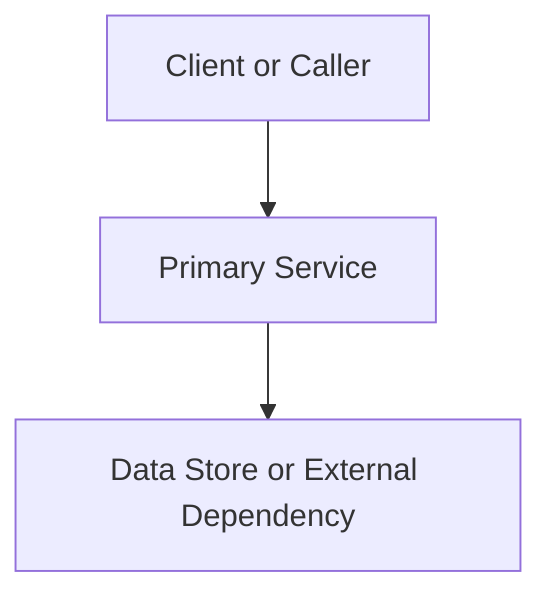

# Design Document

## Overview

Summarize the solution, scope, assumptions, and the user-visible outcome for "{{FEATURE_TITLE}}".

## Architecture

Describe the architectural approach, boundaries, major flows, and why this design fits the approved requirements.

## Components and Interfaces

List the components that will be created or changed and the interfaces between them.

### Component A

- Responsibility:
- Inputs:
- Outputs:
- Files or modules:

## Data Models

Describe new or modified data structures, schemas, persisted fields, API payloads, or state transitions.

## Error Handling

Describe failure modes, retries, validation, fallback behavior, and user-facing error states.

## Testing Strategy

Describe how the design will be validated through automated tests. Cover unit, integration, and end-to-end style tests where appropriate.
